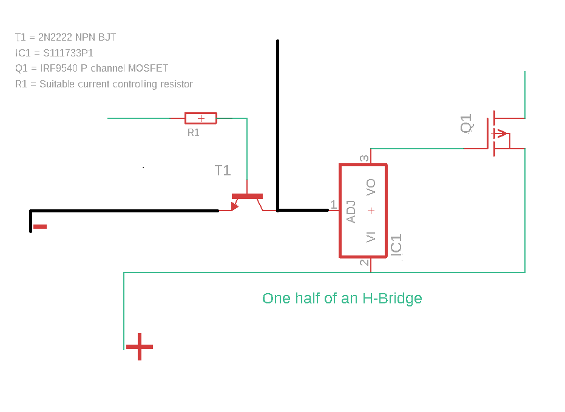

# H Bridge electronic circuit

H-Bridge is an electronic circuit that switches the polarity of voltage applied to a load.

Given the fact that by changing the direction of the rotation the DC motors can run with either polarity. An H bridge is an electronic circuit which can be used to switch the polarity of a attached motor, thus making the motor run forward or in backwards directions.

An H Bridge can be used in many different power electronics. The H Bridge of this repository which is built with few discrete components has one purpose only and that would be to control the direction of the rotation of a brushed DC motor.

### The list of components that you would need to make this circuit

- Two P-channel enhancement mode MOSFETs
- Two NPN BJTs
- Two voltage regulators
- Couple of resistors, to manage the flow of current at the base pins of NPN transistors

### Video of prototype of this circuit

Following is a link of a video about the working prototype of this H-Bridge electronic circuit...

[H-Bridge electronic circuit](https://www.youtube.com/watch?v=_cwA7jFTUsA&t=6s)

### The circuit sketches

